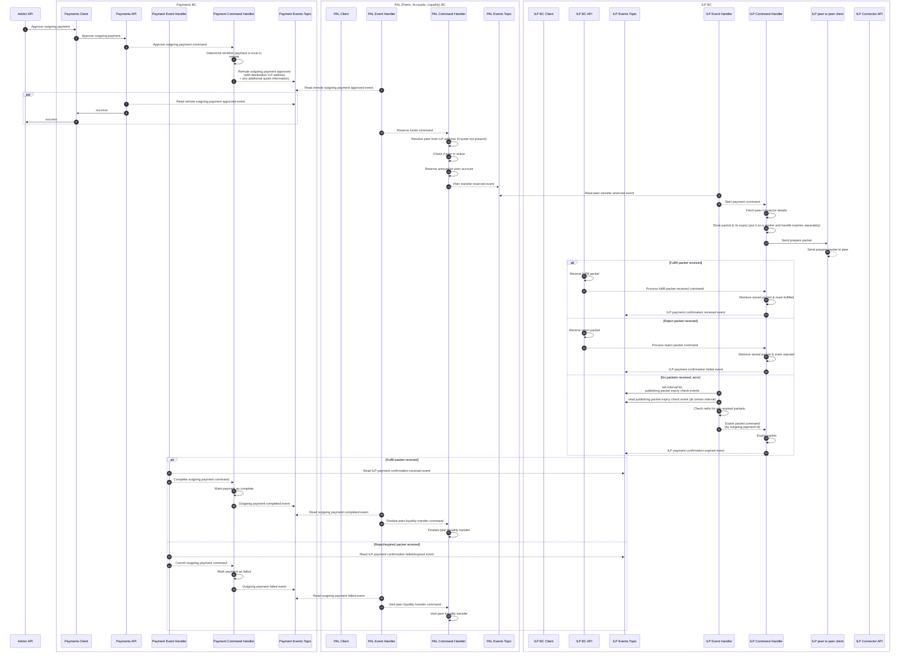

# Remote Outgoing Payment - Sending

```mermaid
sequenceDiagram
	autonumber

    participant AGW as Admin API

    box Payments BC
	participant PC as Payments Client
	participant PAPI as Payments API
	participant PEH as Payment Event Handler
    participant PCH as Payment Command Handler
    participant PET as Payment Events Topic
    end

    box PAL (Peers, Accounts, Liquidity) BC
    participant PALC as PAL Client
    participant PALEH as PAL Event Handler
    participant PALCH as PAL Command Handler
    participant PALET as PAL Events Topic
    end

    box ILP BC
    participant ILPC as ILP BC Client
    participant ILPAPI as ILP BC API
    participant ILPET as ILP Events Topic
    participant ILPEH as ILP Event Handler
	participant ILP as ILP Command Handler
    participant ILPPC as ILP peer to peer client
    participant ILPCAPI as ILP Connector API
    end


    AGW ->> PC: Approve outgoing payment
    PC ->> PAPI: Approve outgoing payment
    PAPI -->> PCH: Approve outgoing payment command
	PCH ->> PCH: Determine whether payment is local or <br> remote
    PCH -->> PET: Remote outgoing payment approved <br> (with destination ILP address <br> + any additional quote information)

    PALEH -->> PET: Read remote outgoing payment approved event
    par
    PAPI -->> PET: Read remote outgoing payment approved event
    PAPI ->> PC: success
    PC ->> AGW: success
    end
    PALEH -->> PALCH: Reserve funds command
    PALCH ->> PALCH: Resolve peer from ILP address (if quote not present)
    PALCH ->> PALCH: Check if peer is active
    PALCH ->> PALCH: Reserve amount for peer account
    PALCH -->> PALET: Peer transfer reserved event

    ILPEH -->> PALET: Read peer transfer reserved event
    ILPEH -->> ILP: Start payment command
    ILP ->> ILP: Fetch peer connector details
    ILP ->> ILP: Store packet & its expiry (put it on a worker and handle expiries separately)

    ILP ->> ILPPC: Send prepare packet
    ILPPC -->> ILPPC: Send prepare packet to peer
    alt Fulfill packet received
    ILPAPI ->> ILPAPI: Receive fulfill packet
    ILPAPI -->> ILP: Process fulfill packet received command
    ILP ->>ILP: Retrieve stored packet & mark fulfilled
    %% ILP -->> ILP: Finalize liquidity transfer
    ILP -->> ILPET: ILP payment confirmation received event

    else Reject packet received
    ILPAPI ->> ILPAPI: Receive reject packet
    ILPAPI -->> ILP: Process reject packet command
    ILP ->>ILP: Retrieve stored packet & mark rejected
    ILP -->> ILPET: ILP payment confirmation failed event
    else No packets received, error
    ILPEH ->> ILPET: set interval for <br>publishing packet expiry check events
    ILPEH ->> ILPET: read publishing packet expiry check event (at certain interval)
    ILPEH ->> ILPEH: Check redis for any expired packets
    ILPEH -->> ILP: Expire packet command <br>(by outgoing payment id)
    ILP ->>ILP: Expire packet
    ILP -->> ILPET: ILP payment confirmation expired event
    end
    alt Fulfill packet received
    PEH -->> ILPET: Read ILP payment confirmation received event
    PEH -->> PCH: Complete outgoing payment command
    PCH ->> PCH: Mark payment as complete
    PCH -->> PET: Outgoing payment completed event

    PALEH -->> PET: Read outgoing payment completed event
    PALEH -->> PALCH: Finalize peer liquidity transfer command
    PALCH ->>PALCH: Finalize peer liquidity transfer

    else Reject/expired packet received
    PEH -->> ILPET: Read ILP payment confirmation failed/expired event
    PEH -->> PCH: Cancel outgoing payment command
    PCH ->> PCH: Mark payment as failed
    PCH -->> PET: Outgoing payment failed event

    PALEH -->> PET: Read outgoing payment failed event
    PALEH -->> PALCH: Void peer liquidity transfer command
    PALCH ->>PALCH: Void peer liquidity transfer
    end
```
