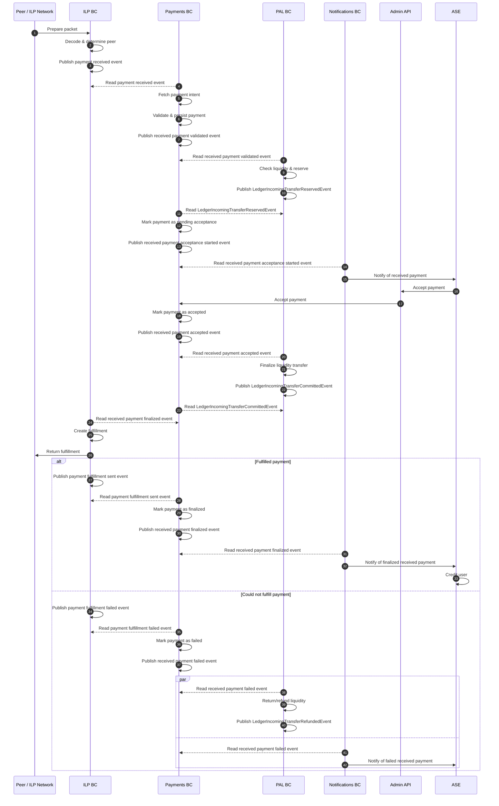

# Remote Outgoing Payment - Receiving

```mermaid
sequenceDiagram
	autonumber


    participant Peer as Peer / ILP Network
    participant ILPBC as ILP BC
    participant PBC as Payments BC
    participant PAL as PAL BC
    participant NBC as Notifications BC
    participant AAPI as Admin API
    participant ASE as ASE

    Peer ->> ILPBC: Prepare packet
    ILPBC ->> ILPBC: Decode & determine peer
    ILPBC ->> ILPBC: Publish payment received event

    PBC -->> ILPBC: Read payment received event
    PBC ->> PBC: Fetch payment intent
    PBC ->> PBC: Validate & persist payment
    PBC ->> PBC: Publish received payment validated event

    PAL -->> PBC: Read received payment validated event
    PAL ->> PAL: Check liquidity & reserve
    PAL ->> PAL: Publish LedgerIncomingTransferReservedEvent

    PBC -->> PAL: Read LedgerIncomingTransferReservedEvent
    PBC ->> PBC: Mark payment as pending acceptance
    PBC ->> PBC: Publish received payment acceptance started event

    NBC -->> PBC: Read received payment acceptance started event
    NBC ->> ASE: Notify of received payment
    ASE ->> AAPI: Accept payment
    AAPI ->> PBC: Accept payment
    PBC ->> PBC: Mark payment as accepted
    PBC ->> PBC: Publish received payment accepted event

    PAL -->> PBC: Read received payment accepted event
    PAL ->> PAL: Finalize liquidity transfer
    PAL ->> PAL: Publish LedgerIncomingTransferCommittedEvent

    PBC -->> PAL: Read LedgerIncomingTransferCommittedEvent


    ILPBC -->> PBC: Read received payment finalized event
    ILPBC ->> ILPBC: Create fulfillment
    ILPBC ->> Peer: Return fulfillment

    alt Fulfilled payment
    ILPBC ->> ILPBC: Publish payment fulfillment sent event
    PBC -->> ILPBC: Read payment fulfillment sent event
    PBC ->> PBC: Mark payment as finalized
    PBC ->> PBC: Publish received payment finalized event
    NBC -->> PBC: Read received payment finalized event
    NBC ->> ASE: Notify of finalized received payment
    ASE ->> ASE: Credit user

    else Could not fulfill payment
    ILPBC ->> ILPBC: Publish payment fulfillment failed event
    PBC -->> ILPBC: Read payment fulfillment failed event
    PBC ->> PBC: Mark payment as failed
    PBC ->> PBC: Publish received payment failed event
    par
    PAL -->> PBC: Read received payment failed event
    PAL ->> PAL: Return/refund liquidity
    PAL ->> PAL: Publish LedgerIncomingTransferRefundedEvent
    and
    NBC -->> PBC: Read received payment failed event
    NBC ->> ASE: Notify of failed received payment
    end
    end
```
