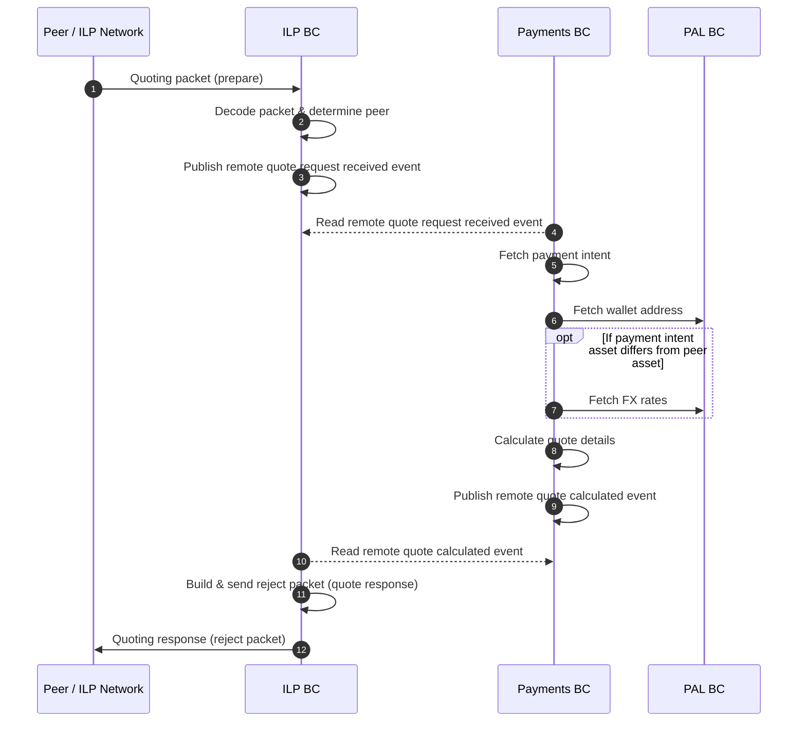

# Remote Quote - Receiving

```mermaid
sequenceDiagram
	autonumber


    participant Peer as Peer / ILP Network
    participant ILPBC as ILP BC
    participant PBC as Payments BC
    participant PAL as PAL BC

    Peer ->> ILPBC: Quoting packet (prepare)
    ILPBC ->> ILPBC: Decode packet & determine peer
    ILPBC ->> ILPBC: Publish remote quote request received event

    PBC -->> ILPBC: Read remote quote request received event
    PBC ->> PBC: Fetch payment intent
    PBC ->> PAL: Fetch wallet address
    opt If payment intent asset differs from peer asset
    PBC ->> PAL: Fetch FX rates
    end
    PBC ->> PBC: Calculate quote details
    PBC ->> PBC: Publish remote quote calculated event

    ILPBC -->> PBC: Read remote quote calculated event
    ILPBC ->> ILPBC: Build & send reject packet (quote response)
    ILPBC ->> Peer: Quoting response (reject packet)
```
