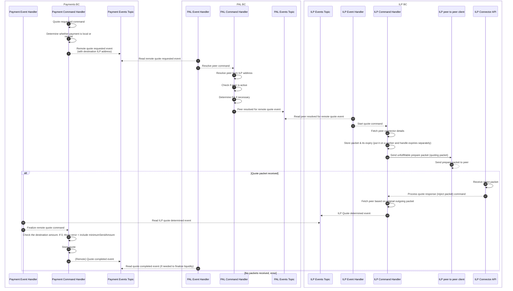

# Remote Quote - Sending

```mermaid
sequenceDiagram
	autonumber

    box Payments BC
	participant PEH as Payment Event Handler
    participant PCH as Payment Command Handler
    participant PET as Payment Events Topic
    end

    box PAL BC
    participant PALEH as PAL Event Handler
    participant PAL as PAL Command Handler
    participant PALET as PAL Events Topic
    end

    box ILP BC
    participant ILPET as ILP Events Topic
    participant ILPEH as ILP Event Handler
	participant ILP as ILP Command Handler
    participant ILPPC as ILP peer to peer client
    participant ILPCAPI as ILP Connector API
    end


    PCH ->> PCH: Quote requested command
	PCH ->> PCH: Determine whether payment is local or <br> remote
    PCH -->> PET: Remote quote requested event <br> (with destination ILP address)

    PALEH -->> PET: Read remote quote requested event
    PALEH -->> PAL: Resolve peer command
    PAL ->> PAL: Resolve peer from ILP address
    PAL ->> PAL: Check if peer is active
    PAL ->> PAL: Determine FX if necessary
    PAL -->> PALET: Peer resolved for remote quote event

    ILPEH -->> PALET: Read peer resolved for remote quote event
    ILPEH -->> ILP: Start quote command
    ILP ->> ILP: Fetch peer connector details
    ILP ->> ILP: Store packet & its expiry (put it on a worker and handle expiries separately)

    ILP ->> ILPPC: Send unfulfillable prepare packet (quoting packet)
    ILPPC -->> ILPPC: Send prepare packet to peer

    alt Quote packet received
    ILPCAPI ->> ILPCAPI: Receive reject packet
    ILPCAPI -->> ILP: Process quote response (reject packet) command
    ILP ->> ILP: Fetch peer based on original outgoing packet
    ILP -->> ILPET: ILP Quote determined event

    PEH -->> ILPET: Read ILP quote determined event
    PEH -->> PCH: Finalize remote quote command
    PCH ->> PCH: Check the destination amount. If 0, throw error + include minimumSendAmount
    PCH ->> PCH: Store quote
    PCH -->> PET: (Remote) Quote completed event
    PALEH -->> PET: Read quote completed event (if needed to finalize liquidity)

    else No packets received, error
    end
```
