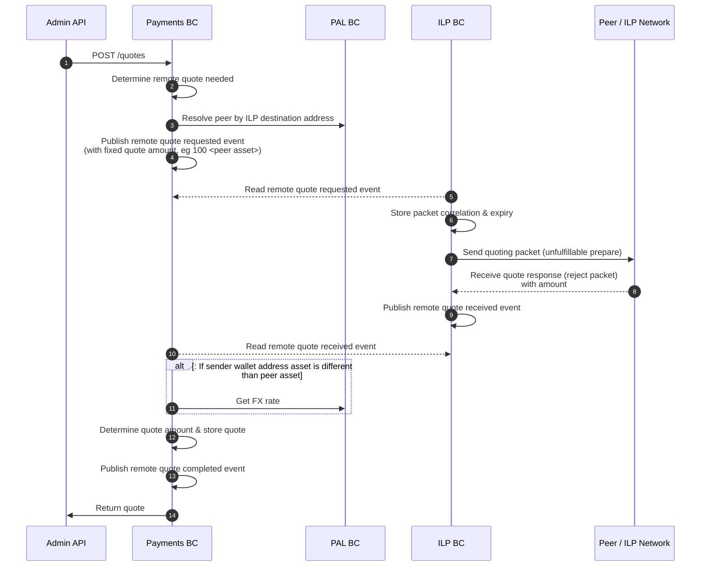

# Remote Quote - Sending

```mermaid
sequenceDiagram
	autonumber

    participant AAPI as Admin API
    participant PBC as Payments BC
    participant PAL as PAL BC
    participant ILPBC as ILP BC
    participant Peer as Peer / ILP Network

    AAPI ->> PBC: POST /quotes
    PBC ->> PBC: Determine remote quote needed
    PBC ->> PAL: Resolve peer by ILP destination address
    PBC ->> PBC: Publish remote quote requested event <br> (with fixed quote amount, eg 100 <peer asset>)

    ILPBC -->> PBC: Read remote quote requested event
    ILPBC ->> ILPBC: Store packet correlation & expiry
    ILPBC ->> Peer: Send quoting packet (unfulfillable prepare)
    Peer -->> ILPBC: Receive quote response (reject packet) <br> with amount
    ILPBC ->> ILPBC: Publish remote quote received event

    PBC -->> ILPBC: Read remote quote received event
    alt: If sender wallet address asset is different than peer asset
    PBC ->> PAL: Get FX rate
    end
    PBC ->> PBC: Determine quote amount & store quote
    PBC ->> PBC: Publish remote quote completed event
    PBC ->> AAPI: Return quote
```
